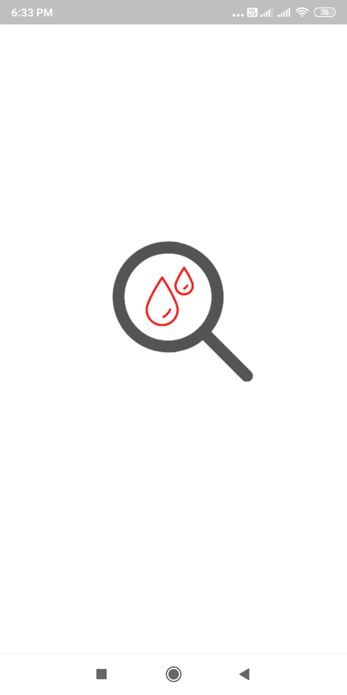
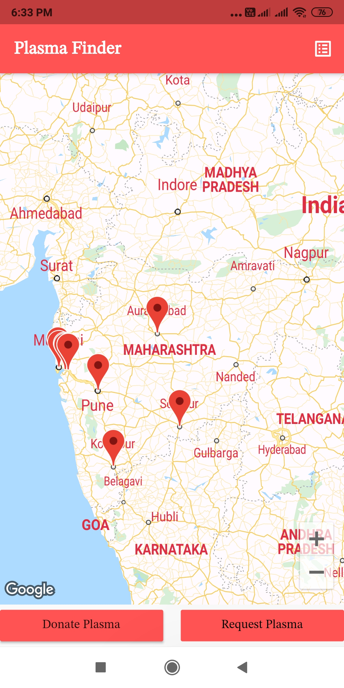
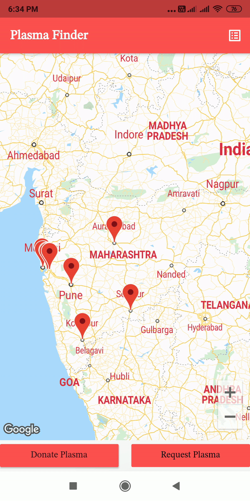
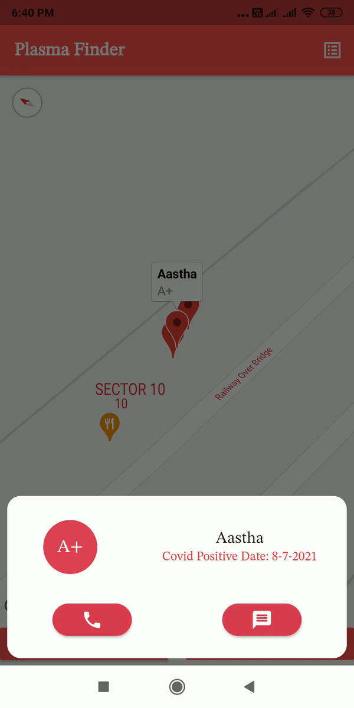

# Plasma Finder
#### The project aims at being a connect between plasma donors and receivers.

# Table of Contents

* [About the Project](#About-the-project)
  - [Description](#description)
  - [Tech Stack](#technology-stack)
  - [Key Features](#key-features)
  - [File Structure](#file-structure)
* [Getting Started](#getting-started)
  - [Prerequisite](#prerequisite)
  - [Installation](#installation)
* [Result](#result)
* [Future Scope](#future-scope)

# About the Project

### Description
Motivation for this project was the upsurge of covid cases and exceeding need of plasma all over the country.
&nbsp;

Plasma was found to be a cure for covid because when the plasma of a person infected with covid is injected into someone's body, it develops antibodies to fight the infection and hence a person develops shield against the virus.&nbsp;

Anyone can be a donor (within the age group of 18 to 65) except those 
- with weight less than 50 kgs

- having Diabetes or Hypertension
- who have been pregnant even once
- with haemoglobin less than normal ranges
- who had asymptomatic infection

All these conditions have been taken care of when a user wants to register him/her as a donor in the app. So to connect donors and receivers this solution was developed.


### Technology stack

Tools and technologies learnt and used in the project.

 - Languages
     1. Dart
 - Tools
     1. Flutter
     2. Firebase
     3. Google Maps API

### Key Features
 - users can register themselves as donors
 - Requestors can find donors nearby them
 - When a requestor requests for plasma, the app locates the current location of the requestor
 - Requestor can then choose from the donors nearest to him/her and look for blood group which is required
 - Requestor can contact the donor by call or text

### File Structure

```bash
.
├── lib
│   ├── customised
│   │   ├── customDialogs.dart
│   │   ├── customWaveIndicator.dart
│   │   └── rippleIndicator.dart
│   ├── generated_plugin_registrant.dart
│   ├── main.dart
│   ├── models
│   │   └── Donor.dart
│   └── screens
│       ├── donor_input_page.dart
│       ├── donors.dart
│       ├── homePage.dart
│       └── splash.dart
├── pubspec.yaml
├── README.md

```

# Getting Started

### Prerequisite
 - flutter SDK

### Installation
clone the repo
 - git clone https://github.com/Nishtha2709/plasmaFinder

### Usage
install the apk or
- flutter install

### Result   

* [GitHub repo link](https://github.com/Nishtha2709/plasmaFinder)
* Video of app: [Click here](https://drive.google.com/file/d/1n6d9pgdAhTbiwObpMWVDyaOXCsBq99Xb/view?usp=sharing)

### Screenshots
    
     
<p>      
</p>


### Future scope
Features aimed to be implemented in next phase :
- since plasma is not a viable cure for covid now, this app can be transformed into a blood donation app
- Information of nearest blood banks can also be incorporated where both donor and requestor can go to do the needful.
- donor once registered can also cancel their registration

